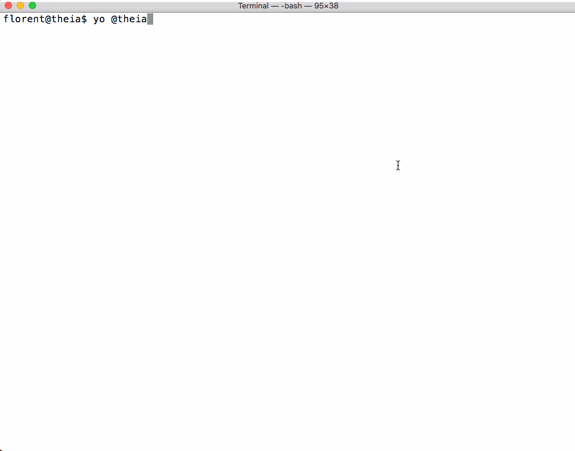

import DocArrowNavigators from 'components/DocArrowNavigators'

#  Authoring Theia Plug-ins

Let's create our first Theia plug-in. As an example, we are going to register a command _Hello World_ that displays a notification "Hello world!". This article is guiding you through all the necessary steps.

## Theia’s Architecture


### Plug-in vs Extension

Theia is an extensible IDE. You may already have heard extensions as being a way to customize the IDE. Plug-ins is a new extensibility model that has been added recently into Theia. Here are the main differences between plug-ins vs the extensions.

#### Plug-ins

pros:
 + Code isolation: as plug-in's code in running in separate processes, it can't block Theia core processes.
 + Can be loaded at runtime. No need to recompile the full IDE of Theia.
 + Reduce compilation time
 + Self-contained. A plug-in can be packaged into a single file and loaded directly after. No extra need to grab dependencies from npmjs, etc.
 + Simple API
   + no need to learn inversify or any framework.
   + single entry point, with code completion to see possible calls with associated JsDoc.
 + Upgrade easily from one theia version to another version as API is backward compliant.

cons:
 - Need to stick to this pre-defined API. It's not possible to tweak something if contribution point is not provided through API. Note that current API can be extended to support more stuff ;-)


### Design
A Theia app is composed of a core providing a set of widgets, commands, handlers, etc. for a specific functionality.

Theia defines a runtime API allowing plug-ins to customize the IDE and add their behaviour to various aspects of the application.

In Theia, a plug-in has access to the API through an object named `theia` which is available in all plug-ins.
[More details on API](https://github.com/theia-ide/theia/blob/master/packages/plugin/README.md).

There are two natures of plug-ins:
 - Backend plug-in. If you're familiar with VS Code extensions, it's very close. The plug-in's code is running in its own process on the server side. API is called and it's the API that will send some actions on user's browser/UI to register new commands, etc. All the callbacks are executed on the server side on a dedicated process.
 - Frontend plug-in. In that case, callbacks are executed in a worker thread on the UI/browser. These plug-ins are only authorized to use "browser compliant" modules. For example opening or writing to a file is impossible as all the code of the plug-in is running on the browser side. But this approach is helpful if you really want to have some stuff on the client side to avoid some network operations.

## Prerequisites

Having a running Theia instance. (v0.3.12+)
Instructions for getting Theia are available from [Theia repository](https://github.com/theia-ide/theia#getting-started).

## Project Layout

We are going to create a new project and for this we will create a folder named `theia-hello-world-plugin` that will contain the source code of the project.

This new folder can be created in any directories, it is independent of Theia source code.

To ease the setup of such a repository, a [Yeoman code generator](https://www.npmjs.com/package/@theia/generator-plugin) exists and can be installed to scaffold the project.

Generator can be installed and executed with the following commands. Note that these commands can be entered from a new terminal inside your running Theia instance.

```bash
npm install -g yo @theia/generator-plugin
mkdir theia-hello-world-plugin
cd theia-hello-world-plugin
yo @theia/plugin
```

In the previous commands:
- `npm install -g yo @theia/generator-plugin` command install globally the Theia generator.
- `yo @theia/plugin` is calling the yeoman generator asking to use for templating the Theia's plug-in generator.


here is animated screenshot of the generator running.


Pick up default values for each questions.

At this step, in `theia-hello-world-plugin` folder there is a plug-in that is already built with associated source code.

## Implementing the Plug-in

Let's have look at the generated code now.

```json
{
      "name": "theia-hello-world-plugin",
      "publisher": "theia",
      "keywords": [
        "theia-plugin"
      ],
      "version": "0.0.1",
      "files": [
        "src"
      ],
      "devDependencies": {
        "@theia/plugin": "latest", <-- 1. Theia API dependency
        "rimraf": "^2.6.2",
        "typescript": "^2.9.2"
      },
      "scripts": {
        "prepare": "yarn run clean && yarn run build",
        "clean": "rimraf lib",
        "build": "tsc"
      },
      "engines": {
        "theiaPlugin": "latest"  <-- 2. this plug-in requires Theia runtime
      },
      "theiaPlugin": {
        "backend": "lib/theia-hello-world-plugin-backend-plugin.js" 3. <-- entrypoint
      }
}
```

There are three important parts in this `package.json` file

1. First, in `devDependencies`, there is the dependency to `@theia/plugin`. This package will be used inside the plug-in's code to call Theia API (like adding a new command and displaying a new information message).

2. Second, the `engines` section contains `theiaPlugin`. It allows to flag this node package as being runnable on top of a specific version of Theia.

3. Third, the `theiaPlugin` section contains the entry-point of the plug-in. For a backend plug-in, it is `backend` key with the value being the path to the javascript path of the plug-in.

Let's have a look to the single source code file that has been generated. The path of this file is `src/theia-hello-world-plugin-backend-plugin.ts`. It contains TypeScript code.


```typescript
import * as theia from '@theia/plugin';

export function start() {
    const informationMessageTestCommand = {
        id: 'hello-world-example-generated',
        label: "Hello World"
    };
    theia.commands.registerCommand(informationMessageTestCommand, (...args: any[]) => {
        theia.window.showInformationMessage('Hello World!');
    });

}

export function stop() {

}
```

As you can see, only few lines of code are required to register a command and display a notification message.

First important line is the import of the API.
The import `import * as theia from '@theia/plugin';` is making all Theia plug-in's API available into a theia object.

In the code, there are two methods that are `start()` and `stop()`

The `start()` method is called when loading the plug-in. In this method, there is one action: registering hello world command and one callback: displaying `Hello World` as an information message. The command object has an `id` and a `label` that will be displayed in the command palette.

There is an empty `stop()` method that could be used to do something when the plug-in is stopped. This method is optional and may be removed if empty.

## Executing the Plug-in

Now we want to see the plug-in in action. For this purpose, there is a mode called `hosted mode` within Theia. When using this mode, we can develop the plug-in within one instance of Theia, and then we can deploy the plug-in in another instance of Theia. So it's very easy to spawn the plug-in and test it.

First, be sure that you've opened the folder where is the generated plug-in inside Theia. (It needs to be part of your workspace)
Then, bring command palette (hiting the F1 key for example) and search for `Hosted mode: start instance` and select this command.


Browse the workspace and select the folder of the plug-in (that contains `package.json` file).


It will spawn a new theia instance on port `3030`. A new tab will be opened (maybe you'll need to validate it) and you've a new instance running as `Development host` (in status bar you can check that name)


Inside the `Development Host` instance, bring command palette (F1 key) and then search for `Hello World` command.


 Select it and you'll see a notification `Hello World` on the screen.


## Developing the Plug-in

As previously said, Theia API is provided through TypeScript, then there is code completion and JsDoc available when developing.


## Updating the Plug-in

Let say you want to change the information message from `Hello World` to `Hello Theia`. Let's go into the `Hosted Plugin: running` instance (status bar), edit the TypeScript file `src/theia-hello-world-plugin-backend-plugin.ts` and perform the following change.
Replace `theia.window.showInformationMessage('Hello World!');` by  `theia.window.showInformationMessage('Hello Theia!');`

Run the command `yarn build` from root folder of the plug-in so source code is recompiled.
Then you'll only have to refresh the tab of the `Development Host` instance, the plugin will be reloaded again.

Note: you may use watch mode as well.

## API of plug-ins
[Browse typedoc of plug-ins](https://theia-ide.github.io/theia/docs/next/modules/plugin.__theia_plugin_-1.html)

## VS Code implementation
Theia is providing VS Code API. Check the following link to get the current status of what is implemented.
[Compare Theia vs VS Code API](https://che-incubator.github.io/vscode-theia-comparator/status.html)


<DocArrowNavigators prev="authoring_extensions" next="language_support"/>
